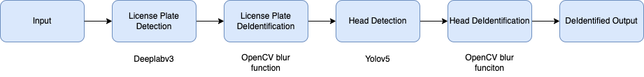
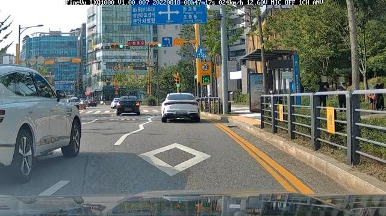
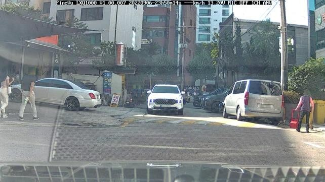
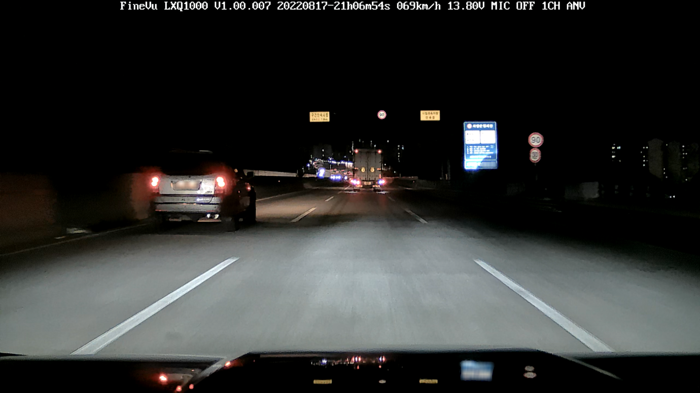

# 🔒 Image & Video De-identification System

이미지 및 영상 내 번호판과 얼굴 정보를 자동으로 비식별화하는 딥러닝 기반 시스템입니다.



## 주요 기능

- DeepLabV3 기반 번호판 Segmentation
- YOLOv5 기반 얼굴 검출 및 블러 처리
- 이미지 및 영상 파일의 자동 비식별화 파이프라인
- CLI 기반 다중 입력, 디렉토리 처리 기능

## 기술 스택

- Python 3.11.5
- PyTorch, OpenCV, torchvision
- DeepLabV3 (License Plate), YOLOv5-crowdhuman (Head Detection)
- CUDA 11.8+, cuDNN 8.7+

## 핵심 알고리즘

### License Plate Detection & Blur
- 모델: DeepLabV3
- 처리: Bounding Box 검출 후 `cv2.blur(ksize=(50,50))`

### Head Detection & Blur
- 모델: YOLOv5-crowdhuman
- 처리: Bounding Box 검출 후 `cv2.blur(ksize=(100,100))`

## 개발자 역할

- 차량 번호판 / 사람 얼굴 디텍션 모델 선정 및 실험 주도  
  - DeeplabV3, YOLOv5-crowdhuman 등 다양한 딥러닝 모델 비교 후 최종 선정  
  - 모델 성능 평가 (Precision, Recall, mAP 등) 및 하이퍼파라미터 튜닝 진행

- 디텍션 결과 기반 Blur 처리 파이프라인 구현  
  - 디텍션된 Bounding Box 좌표를 기반으로 OpenCV blur 함수 적용  
  - 번호판 및 머리 영역의 자동 추출 및 비식별화 처리 전체 로직 구현 주도

- 전체 파이프라인 통합 개발 참여  
  - 이미지 및 영상 입력 → 디텍션 → Blur → 결과 저장의 전체 흐름 구현에 폭넓게 기여  
  - CLI 기반 실행 스크립트 옵션 정리 및 예외 처리 로직 구현


## 성능 평가

### DeeplabV3 (License Plate Detection)

- 평가 데이터: 블랙박스 영상에서 추출한 200개 샘플
- 총 타겟: 688개

| Metric     | Value |
|------------|-------|
| Precision  | 0.890 |
| Recall     | 0.875 |

### YOLOv5-crowdhuman (Head Detection)

- 평가 데이터: Crowdhuman Validation Set (4,291 images)
- 총 타겟: 약 200,000개

| Class  | Precision | Recall | mAP@0.5 |
|--------|-----------|--------|---------|
| Person | 0.866     | 0.712  | 0.803   |
| Head   | 0.882     | 0.656  | 0.713   |


## 결과 예시




## 프로젝트 구조

```
.
├── data/                # 입력 이미지/영상
├── license/             # 번호판 blur 처리 결과
├── output/              # 최종 결과 (번호판 + 머리 blur)
├── pytorch_licenseplate_segmentation/ # 번호판 모델
├── yolov5_crowdhuman/   # 머리 검출 모델
├── blur.py              # 메인 실행 파일
└── requirements.txt     # 의존 패키지 목록
```

## 설치 및 실행

### 1. Conda 환경 설정
```bash
conda create -n blur_env python=3.11.5
conda activate blur_env
pip install -r requirements.txt
```

### 2. 기본 실행
```bash
python blur.py
```

### 3. 추가 옵션

| 옵션 | 설명 |
|------|------|
| --initial_source | 입력 파일 경로 지정 |
| --project | 결과 저장 폴더 지정 |
| --name | 결과물 폴더 이름 지정 (exp 기본값) |
| --exist-ok | 결과 폴더가 존재해도 덮어쓰기 허용 |
| --person | 사람 전체 비식별화 옵션 활성화 |

#### 예시
```bash
python blur.py --initial_source ./custom_input --project ./results --name result_v2 --exist-ok
```

## 산학협력 성과

- NC& 기업과의 산학협력 과제 수행
  - 실제 블랙박스 데이터 기반 검증 및 피드백 반영
  - 기업 요구사항에 맞춘 비식별화 성능 개선
  - 시스템 최적화 및 사용자 입력 기반 처리 기능 구현

## 참고 문헌

- YOLOv5 Crowdhuman: https://github.com/deepakcrk/yolov5-crowdhuman
- License Plate Segmentation: https://github.com/dbpprt/pytorch-licenseplate-segmentation
---
- [📄 캡스톤 디자인 판넬 PDF 보기](src/capstone_panel.pdf)